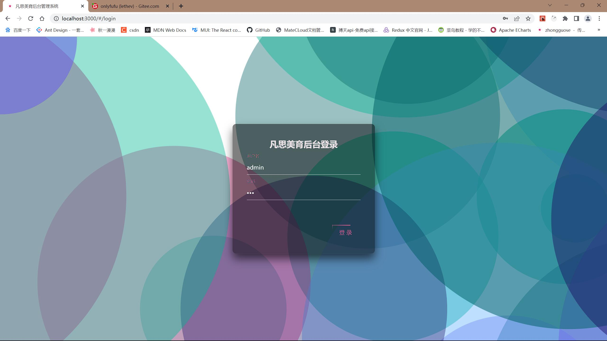
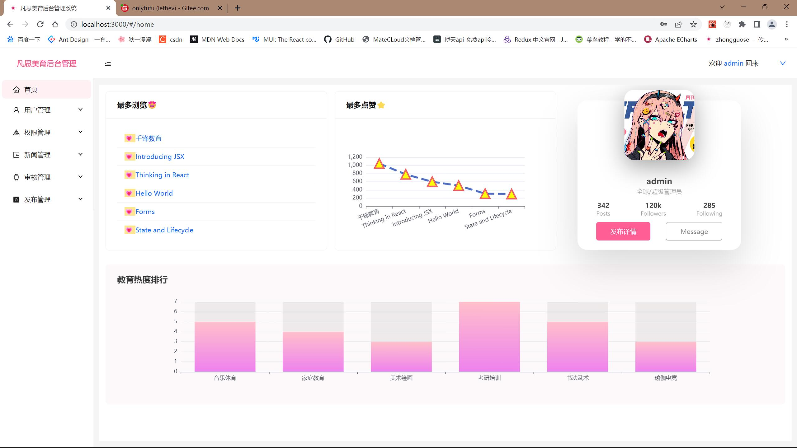
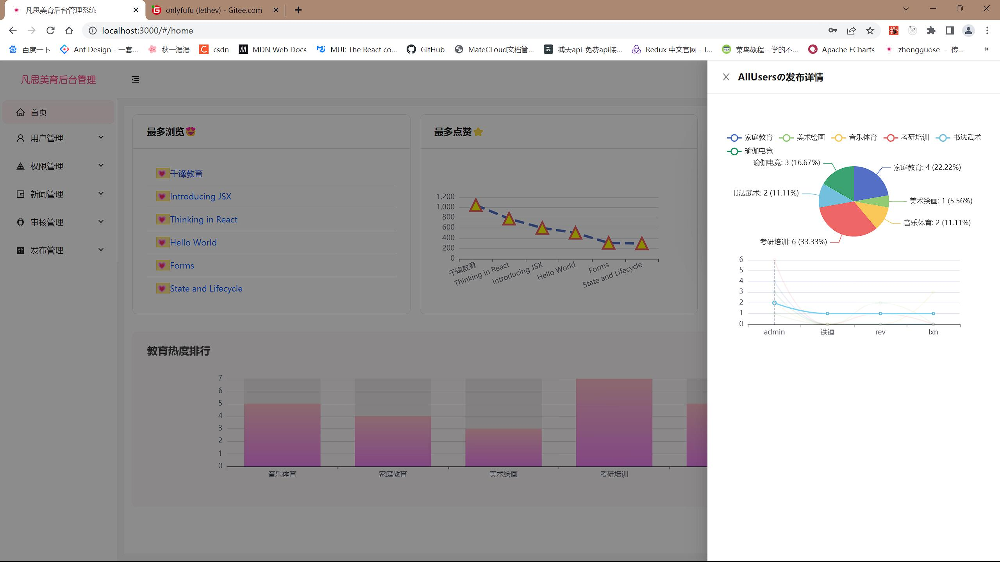
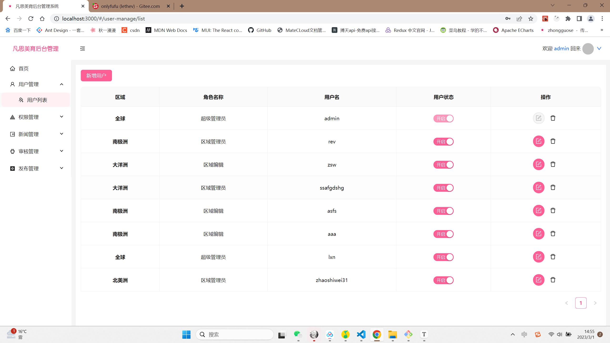
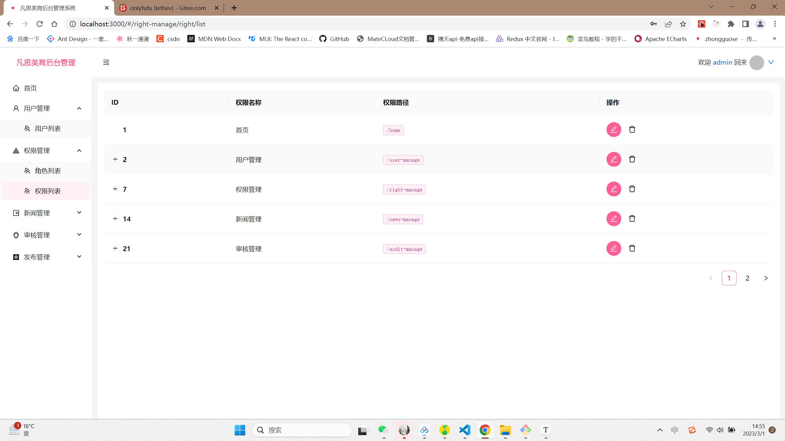
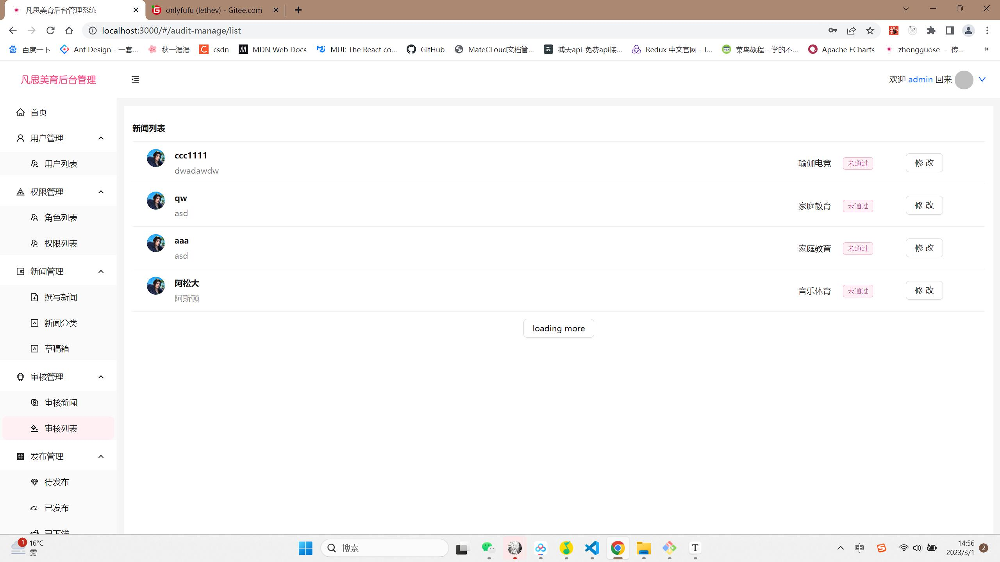
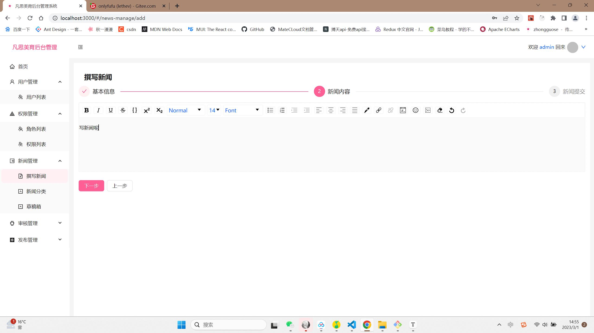
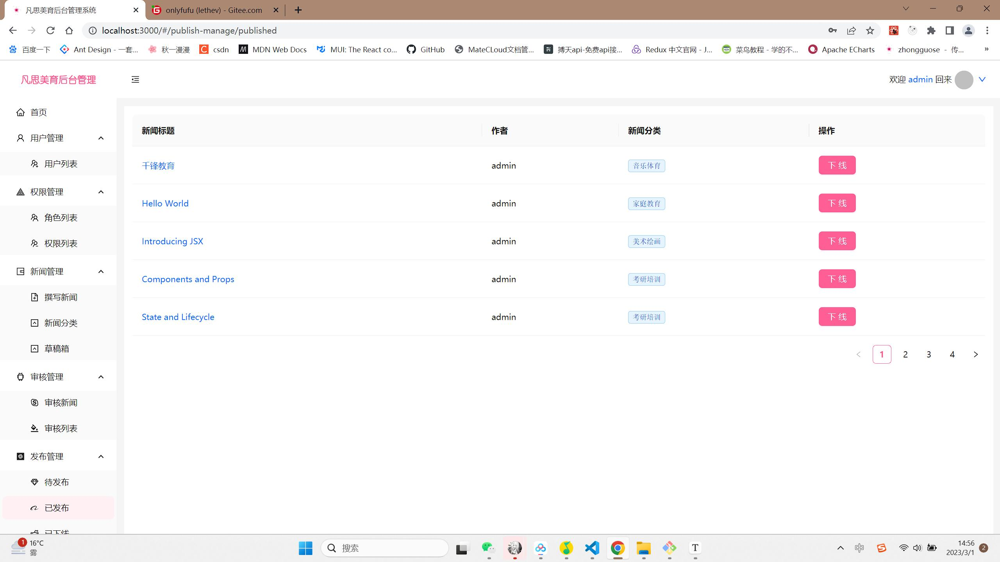

## 新闻管理系统

### 项目简介

##### 项目描述：

根据不同角色动态生成侧边栏的新闻管理系统，实现了首页+用户管理+权限管理+新闻管理+审核管理+发布管理+查看新闻页面。
角色种类： - 超级管理员（可新增删除修改用户信息，修改权限，审核撰写删除新闻等） - 区域管理员（可审核撰写删除新闻等） - 新闻管理员（可撰写新闻，发布新闻，在草稿箱保存新闻，查看待发布，已发布，已下架新闻等等）

#### 项目技术：

React+React Router6+Redux+redux-persist+Antd5+Axios+json-server+echarts

#### 项目特点

- 利用 react 的 UI 组件库搭建基本的页面，并划分功能区，可熟练运用 antd 中的组件库
- 联合 localStorage 和 redux 进行双向数据存取以解决页面刷新后的 store 对象的数据丢失问题，并保证用户的可持续登录;同时引入 persistStore，persistReducer 和 storage 实现数据的可持续化存储，确保数据不会在刷新后消失，保证页面的基本呈现，提供良好的用户体验
- 对 axios 进行封装以方便请求数据的统一拆解和处理，并设置 axios 拦截器，对数据请求失败做出统一的呈现
- 封装新闻展示、新闻更新等常用的组件，定义基本的页面，利用前后端交互进行数据交互，呈现不同的页面内容新闻编辑页面
- 利用插件 draft-js 实现富文本编辑，同时利用 html-to-draftjs 实现文本的解析与呈现
- 基于 echarts 实现数据的可视化展示，利用不同的视图呈现数据，给用户直观的体验

#### 项目启动

在 src 目录下：`npm start`
在 db 目录下：json-server .\db.json --watch --port 5000

#### 项目演示

##### 登录

##### 首页

##### echarts 实现数据展示

##### 用户列表

##### 权限管理

##### 新闻列表

##### 撰写新闻

##### 发布管理

